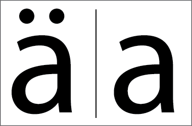

# DeConfuse


<!-- Placeholder for badges https://shields.io -->
 

## About
De confuse is a java librabry which convert confusable unicode characters(similar looking character) or string to english alphabets/strings.

## Using
### Adding as dependency
* For gradle: add `implementation 'io.github.projectclean:deconfuse-0.1.0'` to your `build.gradle` file.
* For Maven: add the following
```aidl
<dependency>
  <groupId>io.github.projectclean</groupId>
  <artifactId>deconfuse</artifactId>
  <version>0.1.0</version>
</dependency>
```

# Example

```
import io.github.projectclean.deconfuse.core.DeConfuse;
import io.github.projectclean.deconfuse.core.DeConfuseFactory;
import io.github.projectclean.deconfuse.enums.Language;

class Test {
    public static void main(String[] args) throws Exception {
        String s = "ƉͤĆоɳſŪȘȄ";
        DeConfuse deConfuse = DeConfuseFactory.createDeConfuse(Language.ENGLISH);
        System.out.println(deConfuse.deConfuseString(s));
    }
}
```